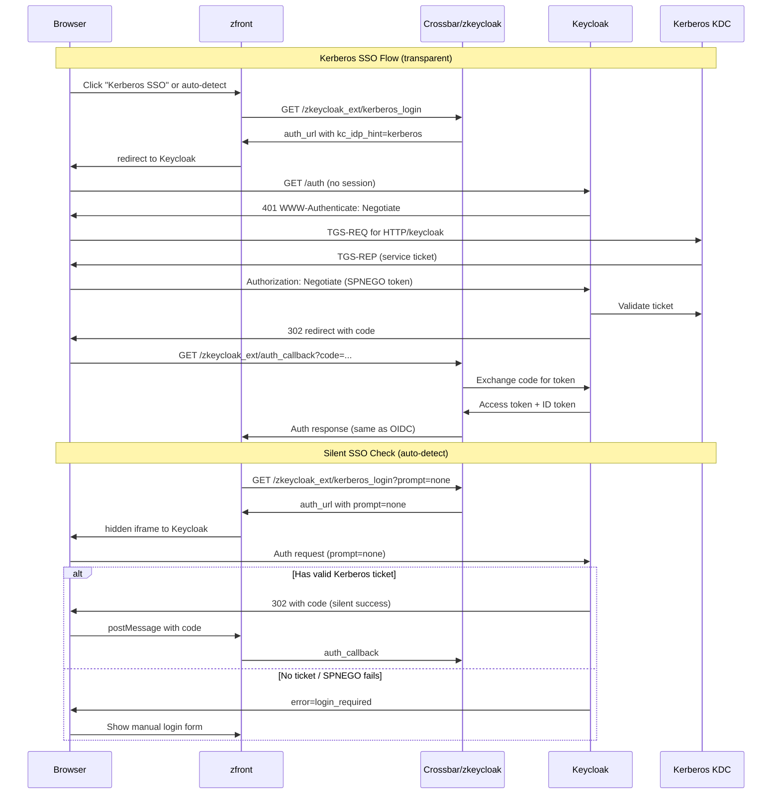

# Kerberos Authentication alongside OIDC

## Architecture

Since Keycloak already has Kerberos User Federation configured, SPNEGO negotiation happens at the Keycloak login page level. The backend redirects the browser to Keycloak with parameters that prioritize the SPNEGO authenticator, and the existing `auth_callback` handles the code exchange identically.




## Backend Changes

### 1. Configuration ([zkeycloak_util.erl](kazoo_5027/applications/zkeycloak/src/zkeycloak_util.erl))

Add new `kapps_config` keys under category `<<"zkeycloak">>`:

- `kerberos_enabled` (`boolean`, default `'false'`) -- master switch for Kerberos SSO
- `kerberos_idp_hint` (`binary`, default `<<"kerberos">>`) -- Keycloak identity provider hint or authentication flow alias to trigger SPNEGO
- `kerberos_redirect_uri` (`binary`, optional) -- separate redirect URI for Kerberos flow if needed (defaults to main `redirect_uri`)

Add helper functions:

```erlang
-spec kerberos_enabled() -> boolean().
kerberos_enabled() ->
    kapps_config:get_is_true(<<"zkeycloak">>, <<"kerberos_enabled">>, 'false').

-spec kerberos_idp_hint() -> kz_term:ne_binary().
kerberos_idp_hint() ->
    kapps_config:get_ne_binary(<<"zkeycloak">>, <<"kerberos_idp_hint">>, <<"kerberos">>).
```

### 2. Kerberos auth URL ([zkeycloak_util.erl](kazoo_5027/applications/zkeycloak/src/zkeycloak_util.erl))

Add `kerberos_auth_url/0` and `kerberos_auth_url/1` that generate a Keycloak authorization URL with SPNEGO-priority parameters using the `oidcc` library's `url_extension` option:

```erlang
-spec kerberos_auth_url() -> kz_term:ne_binary().
kerberos_auth_url() ->
    kerberos_auth_url(#{}).

-spec kerberos_auth_url(map()) -> kz_term:ne_binary().
kerberos_auth_url(ExtraOpts) ->
    BaseExtension = [{<<"kc_idp_hint">>, kerberos_idp_hint()}],
    PromptExtension = case maps:get('prompt', ExtraOpts, 'undefined') of
        'undefined' -> [];
        Prompt -> [{<<"prompt">>, Prompt}]
    end,
    {ok, RedirectUri} =
        oidcc:create_redirect_url(
            client_id_atom(),
            client_id(),
            client_secret(),
            #{'redirect_uri' => redirect_uri(),
              'preferred_auth_methods' => preferred_auth_methods(),
              'url_extension' => BaseExtension ++ PromptExtension
             }
        ),
    kz_binary:join(RedirectUri, <<"">>).
```

The `kc_idp_hint=kerberos` parameter tells Keycloak to skip the login form and go straight to the Kerberos/SPNEGO authenticator. The optional `prompt=none` enables silent SSO detection without user interaction.

### 3. New endpoint ([cb_zkeycloak_ext.erl](kazoo_5027/applications/zkeycloak/src/crossbar/cb_zkeycloak_ext.erl))

Add a new path `<<"kerberos_login">>`:

- `GET /v1/accounts/{id}/zkeycloak_ext/kerberos_login` -- returns `{"auth_url": "..."}` with Keycloak URL targeting the SPNEGO flow
- `GET /v1/accounts/{id}/zkeycloak_ext/kerberos_login?prompt=none` -- returns URL for silent SSO check

Changes:

- Add `-define(KERBEROS_LOGIN, <<"kerberos_login">>).`
- Add `allowed_methods(?KERBEROS_LOGIN) -> [?HTTP_GET]`
- Add `resource_exists(?KERBEROS_LOGIN) -> 'true'`
- Add authenticate/authorize clauses for the new path
- Add `validate(Context, ?KERBEROS_LOGIN)` handler:

```erlang
validate(Context, ?KERBEROS_LOGIN) ->
    case zkeycloak_util:kerberos_enabled() of
        'true' ->
            QS = cb_context:query_string(Context),
            Prompt = kz_json:get_ne_binary_value(<<"prompt">>, QS),
            ExtraOpts = case Prompt of
                <<"none">> -> #{'prompt' => <<"none">>};
                _ -> #{}
            end,
            AuthUrl = zkeycloak_util:kerberos_auth_url(ExtraOpts),
            JObj = kz_json:set_value(<<"auth_url">>, AuthUrl, kz_json:new()),
            cb_context:set_resp_status(cb_context:set_resp_data(Context, JObj), 'success');
        'false' ->
            cb_context:add_system_error('kerberos_not_enabled', Context)
    end;
```

### 4. Auth method detection ([zkeycloak_util.erl](kazoo_5027/applications/zkeycloak/src/zkeycloak_util.erl))

Add a function to detect authentication method from token claims:

```erlang
-spec auth_method(kz_term:ne_binary()) -> 'oidc' | 'kerberos' | 'unknown'.
auth_method(Token) ->
    Claims = jwt_claims(Token),
    Acr = props:get_ne_binary_value(<<"acr">>, Claims, <<>>),
    case Acr of
        <<"kerberos">> -> 'kerberos';
        <<"1">> -> 'oidc';
        _ -> 'unknown'
    end.
```

Keycloak sets the `acr` (Authentication Context Class Reference) claim differently for Kerberos-authenticated users. This lets the backend distinguish how the user authenticated.

### 5. Enhanced callback response ([cb_zkeycloak_ext.erl](kazoo_5027/applications/zkeycloak/src/crossbar/cb_zkeycloak_ext.erl))

Modify `provide_keycloak_token/3` to include the auth method in the response:

```erlang
Props = props:filter_undefined(
    [{<<"account_id">>, AccountId}
    ,{<<"owner_id">>, OwnerId}
    ,{<<"keycloak_resource_access">>, ...}
    ,{<<"auth_method">>, kz_term:to_binary(zkeycloak_util:auth_method(TokenAccess))}
    ]),
```

## Frontend Changes

### 1. API service ([kazoo.js](zfront/src/pages/brt-portal/services/kazoo.js))

Add new function:

```javascript
export async function zkeycloak_kerberos_login(params = {}) {
  const redux_state = getDvaApp()._store.getState();
  const API_URL_V2 = redux_state.settings.crossbarUrlV2;
  const query = params.prompt ? `?prompt=${params.prompt}` : '';
  return request(`${API_URL_V2}/zkeycloak_ext/kerberos_login${query}`, {
    method: 'GET',
  });
}
```

### 2. Login page ([ext/login/index.js](zfront/src/pages/ext/login/index.js))

Add Kerberos SSO button alongside the existing Keycloak button:

```jsx
<Button id="kerberos_login_btn" type="primary" block onClick={() => redirectToKerberos()}>
  {formatMessage({ id: 'ext.kerberos_sign_in', defaultMessage: 'Kerberos SSO' })}
</Button>
```

Add `redirectToKerberos` function (same pattern as `redirectToKeycloack` but calls `zkeycloak_kerberos_login`).

Optionally add auto-detection on page load: try `zkeycloak_kerberos_login({prompt: 'none'})` in a hidden iframe. If Keycloak returns a code silently, authenticate the user without interaction.

### 3. Localization

Add keys to all three locale files:


| Key                    | en-US        | ru-RU               | zh-CN       |
| ---------------------- | ------------ | ------------------- | ----------- |
| `ext.kerberos_sign_in` | Kerberos SSO | Вход через Kerberos | Kerberos 登录 |


Files:

- [en-US.ts](zfront/src/pages/ext/locales/en-US.ts)
- [ru-RU.ts](zfront/src/pages/ext/locales/ru-RU.ts)
- [zh-CN.ts](zfront/src/pages/ext/locales/zh-CN.ts)

### 4. Login model update ([kz_login.js](zfront/src/pages/brt-portal/core_models/kz_login.js))

The existing `keycloak_callback` effect handles both OIDC and Kerberos callbacks identically (same code exchange flow), so no model changes are needed. The `auth_method` field in the response can be stored for UI purposes (e.g., showing "Authenticated via Kerberos" badge).

## Keycloak Configuration Reminder

Since Keycloak is already configured, verify:

- The Kerberos User Federation provider is active
- The Browser authentication flow has the SPNEGO authenticator enabled (with "Alternative" requirement)
- A `kerberos` identity provider hint is correctly mapped (or adjust `kerberos_idp_hint` config)
- The OIDC client used by zkeycloak has "Standard Flow Enabled" = true

## What Does NOT Change

- `crossbar_auth.erl` -- token validation path stays the same; Kerberos-authenticated tokens are still standard Keycloak JWTs
- `zkeycloak_oidcc_sup.erl` -- same OIDC provider worker
- `kapi_zkeycloak.erl` / AMQP handlers -- no changes
- Existing OIDC flow -- fully preserved, Kerberos is an addition not a replacement

